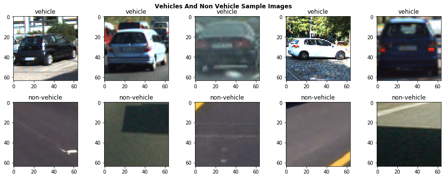
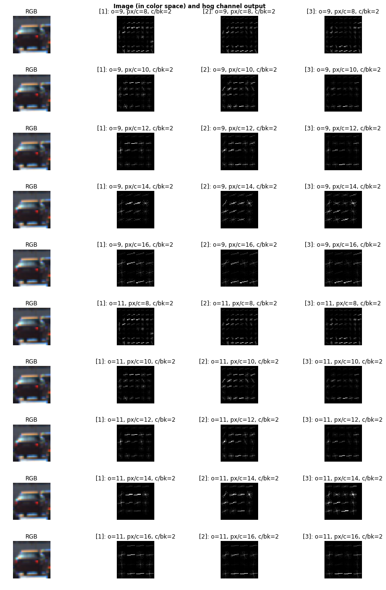
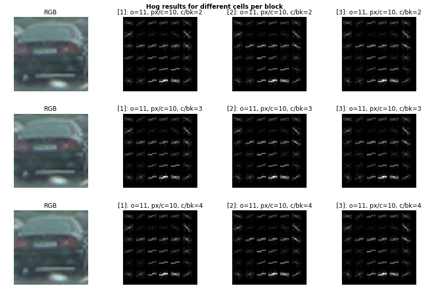
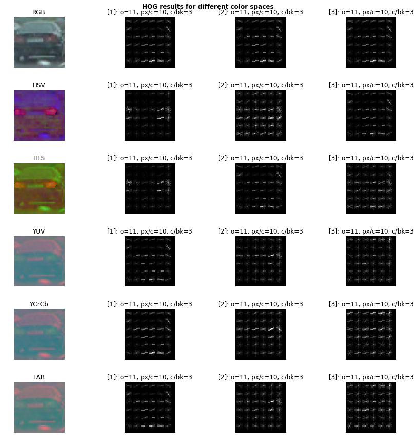
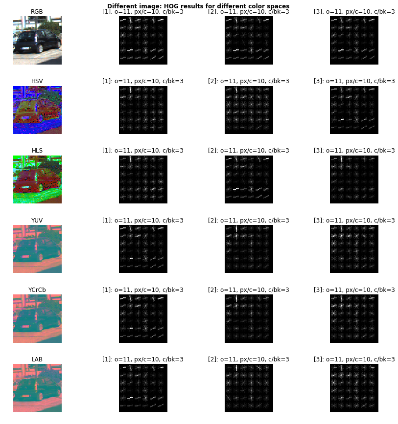
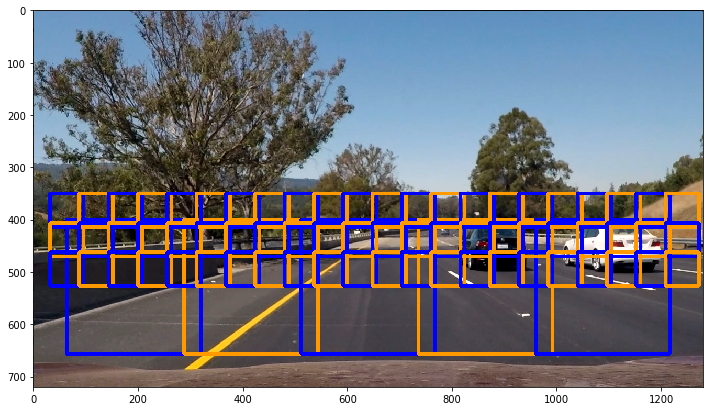
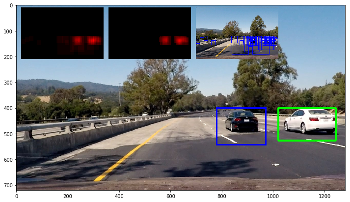

# Vehicle Detection Using Computer Vision And Machine Learning
---

When we drive, we constantly pay attention to our environment, as our safety and that of many other people are at stake. We particularly look out for position of potential _obstacles_, whether they be other cars, pedestrians, or objects on the road. Similarly, as we develop the intelligence and sensors necessary to power a autonomous vehicles, it is of the utmost importance that such vehicles can detect obstacles as well, as it reinforces the car's understanding of its environment. One of the most important types of ostacles to detect is other vehicles on the road, as they would most likely be the biggest objects in our lane or neighbouring ones and therefore constitute a potential hazard.

A number of techniques for obstacle detection have been developed throughout the literature, from traditional computer vision techniques to deep learning ones, and more. In this exercise, we build a vehicle detector by employing a conventional computer vision technique called _Histogram of Oriented Gradients (HOG)_, combined with a machine learning algorithm called _Support Vector Machines (SVM)_.

# Dataset

Udacity generously provided a _balanced_ dataset with the following characteristics:
* ~ 9K images of vehicles
* ~ 9K images of non-vehicles
* all images are 64x64

The dataset comes from the [GTI Vehicle Image Database](http://www.gti.ssr.upm.es/data/Vehicle_database.html), [KITTI Vision Benchmark Suite](http://www.cvlibs.net/datasets/kitti/), and examples extracted from the project video itself. The latter is much larger and was not used for this project. However, it would be a great addition in the future, especially as we plan to build a classifier using deep learning. You can see a sample of images from the dataset below:


We can clearly see both vehicle and non-vehicle images. Non-vehicle images tend to be other elements of the road such as the asphalt, road signs or pavement. The distinction is very clear. Most images also display the vehicle in the center, but in different orientations, which is good. 

The concern however would be that because the vehicle is the central object of these images, we may be suffering from _non-translation_ invariance in the dataset (e.g. image where we see half or less of the vehicle on the side, etc.).


# Exploring Features
## Histogram of Oriented Gradients (HOG)

Using HOG for detection was popularised by Navneet Dalal and Bill Triggs after showing impressive results in their paper named [Histogram of Oriented Gradients For Human Detection](https://hal.inria.fr/inria-00548512/document). The algorithm is well explained by Satya Mallick on this [post](https://www.learnopencv.com/histogram-of-oriented-gradients/), for those who want to acquire a stronger fundamental grasp of HOG.

We firstly explored different configurations for the following values in the HOG algorithm, on a RGB image:
* number of orientations 
* pixels per cell

The cells per block were originally fixed at 2. The images below show the results obtained on the sample vehicle image in RGB format:



From pure observation, it looks like a HOG configuration with:
* 11 orientations
* 10 pixels per cell
* 2 cells per blocks 

produces the most distinctive gradients of a vehicle. We have not experimented with different cells per block so let us try now.



To the human eye, there is no significant difference that we notice visually. We would ideally like to reduce the feature space for faster computation. We will settle for now on 3 cells per block.

## Color Spaces

We must now explore the most suitable color space for our configuration, as it seems our HOG features across the 3 RGB channels are too similar, therefore it feels we are not generating features with enough variations.

We generate the following outputs across a multitude of color spaces:



For some color channels, it is difficult to interpret the result of HOG. Interestingly, it seems the first color channel in YUV, YCrCb, and LAB could be enough to capture the gradients we are looking for. In HSV and HLS it is respectively on the _Value_ and _Lightness_ channels that HOG captures the most significant features for the vehicle.

To confirm our hypothesis, let us try with a different image of a vehicle:



We can see once again that the color channel that carries the most light information produces the most distinctive HOG features. We have many choices available to us, which may produce similar results. For now we will pick the following parameters:
* **Y channel of YCrCb color space**
* **HOG orientations of 11**
* **HOG pixels per cell of 10**
* **HOG cells per block of 3**

Moreover, at this stage, we would like to do away with using color information, as we believe it should not play a discriminative enough role in identifying a vehicle, since we have vehicles of multiple colors. The shape is a much more important factor.

# Classifier

The classifier is responsible for categorising the images we submit into either _vehicle_ or _non-vehicle_ classes. To do so, we must take the following steps:
* Load our images from the dataset
* Extract the features we desire
* Normalise those features 
* Split the dataset for _training_ and _testing_
* Build a classifier with the appropriate parameters
* Train the classifier on _training_ data

As discussed in the previous section, we have decided to only retain one feature: the HOG feature vector computed on the Y channel of our YCrCb image.

We randomly split our dataset, leaving 20% of it for testing. Moreover, we scale the data by employing a [sklearn.preprocessing.StandardScaler](http://scikit-learn.org/stable/modules/generated/sklearn.preprocessing.StandardScaler.html) normaliser. 

We did not have enough time to experiment with many classifiers so opted to use _Support Vector Machines_ (SVM) as they are commonly combined with SVMs in the literature for object detection problems. Moreover, we used a _SVC_ with kernel _rbf_ as it provided the best accuracy, while being slower than a _LinearSVC_. We accepted the tradeoff as the detection of the SVC with rbf kernel was much stronger when we tested it on a series of images.

The ideal parameters for _C_ and _gamma_ were obtained by using the [GridSearchCV](http://scikit-learn.org/stable/modules/generated/sklearn.model_selection.GridSearchCV.html#sklearn.model_selection.GridSearchCV) function.

On the test set, our accuracy is at around 97%.

# Sliding Windows

We created sliding windows of multiple dimensions, randing from 64x64 to 256x256 pixels, to test portions of the image against the classifier and retained only positive predictions. We have the ability to configure the window overlap and have currently set it 75%. The image below shows the example of overlapping bounding boxes:




Larger windows are used at the bottom of screen, where cars are closest, while smaller windows are being slid on higher portions of the screen. We stop attempting to detect vehicles on anything below 400 pixels in the y direction (i.e. higher in the image) . For the project video, I used multiple sliding windows with the following dimensions:
* 256x256
* 224x224
* 192x192
* 128x128
* 96x96
* 64x64

As stated earlier, the bigger windows start from the bottom of the screen while smaller windows will look at higher portions of the screen.

## Heatmap And Thresholding

The classifier sometimes misclassifies sections of the images that are actually not a vehicle. To avoid highlighting those on the video, we take advantage of the redundancy we created with our multi-size sliding windows and count the number of times our classifier predicted vehicle for a given section of the image across all the windows it appears in. We first label objects with overlapping windows using _scipy.ndimage.measurements_' [label](https://docs.scipy.org/doc/scipy-0.16.0/reference/generated/scipy.ndimage.measurements.label.html) function. We then extract the positions of each label by determining the biggest bounding box our detected object could fit in.
We only retain sections of the image where the detected threshold is set to a particular value. From experimentation, we find out that a threshold of 4 is enough to attain solid results on the project video. The photo below illustrates how the heatmap and thresholding work:



The first mini heatmap represents the original raw detections from the classifier, whereas the second one shows the thresholded areas, where the intensity of the red increases as the number of overlapping windows goes up. The last mini image on the right shows all the windows where our classifier predicted _vehicle_.


## Frame Aggregation

To further strengthen our pipeline, we have decided to smoothen all detected windows every _n_ frames. To do so, we accumulate all detected windows between frames _n*f+1_ to _n*f_, where _n_ is a scalar that represent the _group_ of frames we are in. We have created the following class that encapsulates a detected object:

```
class DetectedObject:
    """
    The DetectedObject class encapsulates information about an object identified by our detector
    """
...
```

Everytime we detect a new object on the current or next frames in the group, we check whether we have detected a similar object in the past, and if so, we **increment the detection count** of this object. At frame _n*f_ we only retain detected objects (and their associated bounding boxes) that have over m detected counts, thereby achieving some kind of double filtering in the pipeline (the first filtering was the threshold on the number overlapping bounding boxes).

# Final result

The video link below shows a successful detection of vehicles.

**PUT LINK TO VIDEO**

# Improvements

This was a tricky project, especially for those who opted for the more conventional computer vision and machine learning approach as opposed to deep learning. The following steps were quite time consuming:
* determining the most suitable features (HOG, image color histogram, etc)
* exploring the combination of HOG parameters + color spaces
* applying grid search to find the most suitable classifier

Moreover, in our pipeline we struggled with the following:
* Determining correct position of our sliding windows and the overlap
* Identifying suitable _threshold_ for overlapping detection
* Adopting suitable frame sampling rate 
* Finding a good enough minimum detection count over multiple frames
* Aggregating the combined window dimensions for overlapping detections

The pipeline would fail for object that are not vehicles but detected as such by the classifier, and where such false detections occur over enough overlapping windows to break through the threshold configured. The drawn bounding boxes do not perfectly fit the vehicles and are being redrawn every n frames, therefore causing the impression of a lack of smoothness. Moreover, the frame aggregation could be improved by using a rolling window of n frames as opposed to batch aggretation every n frames. Further more, using extra features such as color histogram could make our classifier more robust. The last problem is that our pipeline is _too slow_. We could look at reducing the number of sliding windows as well as employing a faster classifier like a _LinearSVC_ to speed up detection. Still, it is unlikely to work in real time.

In the future, a deep learning approach using for instance [Faster R-CNN](https://arxiv.org/abs/1506.01497) or [YOLO](https://arxiv.org/abs/1506.02640) architectures will be adopted, as these are now the state of the art for detection problems. Nevertheless, this is a worthwhile exercise to better understand traditional machine learning techniques and build intuition on feature selection. Moreover, I was struck by the _beauty and simplicity_ of a technique like HOG, which still manages to produce solid results.


# Acknowledgments

I would like to thank once again my mentor Dylan for his support and advice throughout this term. I am also very grateful to Udacity for putting in place such an exciting and challenging Nanodegree, with great projects and excellent material. 

We stand on the shoulders of giants, and therefore I am thankful for the work produced and shared via papers and code to all researchers in the fields of artificial intelligence, computer vision, and beyond. Without those resources, I would not have been able to "borrow" their ideas and techniques and successfully complete this project. 
